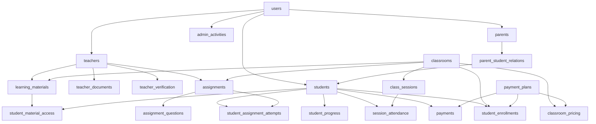

# 🎓 LearnED Platform - Complete System Architecture & User Flows

## 📊 Table Analysis & Justification

### 🔴 **Core Entity Tables**

#### 1. **users** (Essential)
**Purpose**: Central authentication and basic profile data for all user types
**Justification**: 
- Single source of truth for authentication
- Integrates with Supabase Auth
- Contains common fields shared by all user types
- Base table for all other user-specific tables

#### 2. **students** (Essential)
**Purpose**: Student-specific data and academic information
**Justification**:
- Stores student ID, grade level, school information
- Links to parent contact information
- Required for enrollment tracking and academic progress
- Core entity for the primary user base

#### 3. **teachers** (Essential)
**Purpose**: Teacher profiles, qualifications, and professional data
**Justification**:
- Stores teaching credentials and experience
- Manages verification status and ratings
- Required for classroom assignment and quality assurance
- Professional profile for parents/students to evaluate

#### 4. **parents** (Essential)
**Purpose**: Parent profiles for monitoring and payment management
**Justification**:
- Many students are minors requiring parent oversight
- Parents handle payments and monitor progress
- Legal guardian relationships need tracking
- Communication and authorization requirements

#### 5. **classrooms** (Essential)
**Purpose**: Course/class definitions and basic information
**Justification**:
- Core product offering - the classes students enroll in
- Contains subject, grade level, capacity management
- Links to pricing and teacher assignment
- Foundation for the entire learning platform

### 🟡 **Business Logic Tables**

#### 6. **payment_plans** (Essential)
**Purpose**: Flexible pricing models (monthly, quarterly, yearly)
**Justification**:
- Business requirement for different billing cycles
- Allows dynamic pricing strategies
- Supports promotional pricing and discounts
- Scalable monetization model

#### 7. **classroom_pricing** (Essential)
**Purpose**: Links classrooms to their payment plans and prices
**Justification**:
- Allows different pricing for different classrooms
- Supports multiple payment options per classroom
- Essential for the enrollment and payment flow
- Business flexibility for pricing strategies

#### 8. **student_enrollments** (Essential)
**Purpose**: Tracks which students are enrolled in which classrooms
**Justification**:
- Core business relationship - enrollment is the primary transaction
- Tracks enrollment status and progress
- Required for access control and billing
- Foundation for all learning activities

#### 9. **payments** (Essential)
**Purpose**: Financial transaction records
**Justification**:
- Legal and business requirement for payment tracking
- Supports refunds, disputes, and accounting
- Integration with payment gateways
- Required for subscription management

### 🟢 **Learning & Academic Tables**

#### 10. **class_sessions** (Essential)
**Purpose**: Individual class meetings and scheduling
**Justification**:
- Core learning delivery mechanism
- Scheduling and attendance tracking
- Recording and content delivery
- Student and teacher coordination

#### 11. **assignments** (Important)
**Purpose**: Academic work assigned to students
**Justification**:
- Essential for academic progress tracking
- Grading and assessment capabilities
- Student engagement and learning outcomes
- Teacher workflow management

#### 12. **assignment_questions** (Important)
**Purpose**: Individual questions within assignments/quizzes
**Justification**:
- Detailed assessment creation
- Supports various question types
- Granular scoring and analytics
- Enhanced learning experience

#### 13. **learning_materials** (Important)
**Purpose**: Educational content and resources
**Justification**:
- Content delivery for students
- Teacher resource sharing
- Study materials and references
- Enhanced learning experience

#### 14. **student_assignment_attempts** (Important)
**Purpose**: Track student work and grading
**Justification**:
- Academic record keeping
- Progress tracking and analytics
- Multiple attempt support
- Grading workflow for teachers

### 🔵 **Tracking & Analytics Tables**

#### 15. **session_attendance** (Important)
**Purpose**: Track student participation in live sessions
**Justification**:
- Academic requirement for attendance tracking
- Parent reporting and monitoring
- Teacher insights for engagement
- Billing accuracy for attended sessions

#### 16. **student_progress** (Important)
**Purpose**: Academic progress and performance tracking
**Justification**:
- Parent and student dashboards
- Teacher insights for instruction
- Academic analytics and reporting
- Progress-based recommendations

#### 17. **student_material_access** (Optional - Analytics)
**Purpose**: Track which materials students access
**Justification**:
- Learning analytics and insights
- Content effectiveness measurement
- Student engagement tracking
- **Could be simplified or removed for MVP**

#### 18. **system_notifications** (Important)
**Purpose**: Platform-wide messaging and alerts
**Justification**:
- User engagement and communication
- Important updates and announcements
- Assignment deadlines and reminders
- Payment and enrollment notifications

### 🟠 **Administrative Tables**

#### 19. **admin_activities** (Important)
**Purpose**: Audit trail for administrative actions
**Justification**:
- Security and compliance requirements
- Troubleshooting and support
- Administrative oversight
- Legal and audit requirements

#### 20. **teacher_documents** (Important)
**Purpose**: Store teacher verification documents
**Justification**:
- Quality assurance and safety
- Legal compliance for education providers
- Trust building with parents
- Professional verification process

#### 21. **teacher_verification** (Important)
**Purpose**: Track teacher approval workflow
**Justification**:
- Quality control process
- Admin workflow management
- Teacher onboarding pipeline
- Trust and safety requirements

#### 22. **teacher_availability** (Optional - Scheduling)
**Purpose**: Teacher schedule and availability
**Justification**:
- Advanced scheduling features
- Automatic session scheduling
- **Could be simplified for MVP - manual scheduling**

### 🟣 **Relationship & Profile Tables**

#### 23. **parent_student_relations** (Important)
**Purpose**: Link parents to their children
**Justification**:
- Legal guardian relationships
- Multi-child families support
- Access control and permissions
- Communication routing

#### 24. **user_profiles** (Optional - Extended)
**Purpose**: Extended profile information
**Justification**:
- Enhanced user experience
- Address and contact details
- **Could be merged with users table for MVP**

#### 25. **student_subscriptions** (Advanced - Future)
**Purpose**: Subscription management beyond enrollments
**Justification**:
- Advanced billing features
- Subscription lifecycle management
- **Overlaps with student_enrollments - could be removed**

#### 26. **student_classroom_assignments** (Redundant)
**Purpose**: Alternative to student_enrollments with more detail
**Justification**:
- **Redundant with student_enrollments**
- **Should be removed or merged**

#### 27. **enrollment_requests** (Optional - Workflow)
**Purpose**: Track enrollment workflow before payment
**Justification**:
- Multi-step enrollment process
- **Could be simplified to direct enrollment**

### ⚪ **System Tables**

#### 28. **trigger_logs** (Essential)
**Purpose**: System debugging and monitoring
**Justification**:
- Development and troubleshooting
- System health monitoring
- Error tracking and resolution

---

## 🔄 **Table Relationships & Data Flow**

---

## 👥 **Complete User Flows**

### 🎓 **STUDENT FLOW**

#### **Registration & Onboarding**
1. **Account Creation**
   - Student visits registration page
   - Enters email, password, first name, last name
   - Selects user type: "Student"
   - Submits registration form

2. **System Processing**
   - `handle_new_user_signup()` trigger fires
   - Creates record in `users` table with `user_type = 'student'`
   - Automatically generates `student_id` (STU + date + UUID)
   - Creates record in `students` table
   - Links `user_id` to student record

3. **Email Verification**
   - Student receives verification email
   - Clicks verification link
   - Account activated (`email_verified = true`)

#### **Classroom Discovery & Enrollment**
4. **Browse Classrooms**
   - Student logs in to dashboard
   - Views available classrooms from `classrooms` table
   - Filters by subject, grade level, board
   - Sees pricing from `classroom_pricing` + `payment_plans`

5. **Classroom Details**
   - Student clicks on specific classroom
   - Views detailed information, teacher profile, schedule
   - Sees available payment plans (monthly/quarterly/yearly)

6. **Enrollment Process**
   - Student clicks "Enroll Now"
   - Selects payment plan
   - Redirected to payment screen
   - Enters payment information

7. **Payment & Enrollment**
   - Payment processed (simulated or real gateway)
   - `enroll_student_with_payment()` function called
   - Creates record in `payments` table
   - Creates record in `student_enrollments` table
   - Updates `current_students` count in `classrooms`
   - Student receives confirmation

#### **Learning Experience**
8. **Dashboard Access**
   - Student sees enrolled classrooms in "My Classes"
   - Views upcoming sessions from `class_sessions`
   - Accesses learning materials from `learning_materials`

9. **Attend Sessions**
   - Student joins live sessions via meeting URL
   - Attendance tracked in `session_attendance`
   - Can access recorded sessions

10. **Complete Assignments**
    - Views assignments from `assignments` table
    - Submits work tracked in `student_assignment_attempts`
    - Receives grades and feedback
    - Progress updated in `student_progress`

11. **Track Progress**
    - Views academic progress and grades
    - Sees completion statistics
    - Accesses performance analytics

### 👨‍🏫 **TEACHER FLOW**

#### **Registration & Verification**
1. **Admin-Created Account**
   - **Teachers CANNOT self-register** (security measure)
   - Admin uses `create_teacher_by_admin()` function
   - Creates records in `users` and `teachers` tables
   - Initial status: `verification_status = 'pending'`

2. **Document Submission**
   - Teacher receives email with login credentials
   - Uploads verification documents (certifications, ID, etc.)
   - Documents stored in `teacher_documents` table
   - Status: `verification_status = 'pending'`

3. **Admin Verification**
   - Admin reviews submitted documents
   - Updates `teacher_verification` table
   - Approves or rejects teacher application
   - If approved: `is_verified = true`, can start teaching

#### **Teaching Activities**
4. **Classroom Assignment**
   - Admin assigns teacher to specific classrooms via `assign_teacher_to_classroom()` function
   - Updates `teacher_id` foreign key in `classrooms` table
   - Teacher gains access to classroom management

5. **Content Creation**
   - Teacher uploads learning materials to `learning_materials`
   - Creates assignments in `assignments` table
   - Adds questions to `assignment_questions`
   - Schedules sessions in `class_sessions`

6. **Session Management**
   - Conducts live teaching sessions
   - Marks attendance in `session_attendance`
   - Records sessions for later access
   - Manages student participation

7. **Assessment & Grading**
   - Reviews student submissions in `student_assignment_attempts`
   - Provides grades and feedback
   - Updates `student_progress` records
   - Generates progress reports

### 👨‍👩‍👧‍👦 **PARENT FLOW**

#### **Registration & Child Linking**
1. **Account Creation**
   - Parent registers with user type: "Parent"
   - Creates record in `users` and `parents` tables
   - Receives unique `parent_id`

2. **Child Connection**
   - Parent provides student information
   - Admin verifies parent-child relationship
   - Creates record in `parent_student_relations`
   - Parent gains monitoring access

#### **Monitoring & Management**
3. **Child Oversight**
   - Views child's enrolled classrooms
   - Monitors attendance from `session_attendance`
   - Reviews academic progress from `student_progress`
   - Sees assignment grades and feedback

4. **Payment Management**
   - Makes payments for child's enrollments
   - Views payment history from `payments` table
   - Manages subscription renewals
   - Handles billing issues

5. **Communication**
   - Receives notifications about child's activities
   - Communicates with teachers
   - Gets progress reports and updates

### 👑 **ADMIN FLOW**

#### **System Management**
1. **User Management**
   - Creates teacher accounts via `create_teacher_by_admin()`
   - Manages user verification and approval
   - Handles user issues and support

2. **Teacher Verification**
   - Reviews teacher applications
   - Verifies uploaded documents in `teacher_documents`
   - Updates `teacher_verification` status
   - Approves or rejects teacher applications

3. **Content Oversight**
   - Manages classroom creation and configuration
   - Sets pricing in `classroom_pricing`
   - Oversees content quality and compliance
   - Handles reported issues

4. **Analytics & Reporting**
   - Views platform usage statistics
   - Monitors financial performance
   - Generates compliance reports
   - Tracks system health via `trigger_logs`

5. **System Administration**
   - All activities logged in `admin_activities`
   - Manages platform settings and configuration
   - Handles technical issues and maintenance
   - Ensures security and compliance

---

## 🎯 **Finalized MVP Schema**

### **Tables Included (23 Core Tables)**
1. ✅ **Core Entities**: users, students, teachers, parents, classrooms
2. ✅ **Business Logic**: payment_plans, classroom_pricing, student_enrollments, payments
3. ✅ **Learning**: class_sessions, assignments, assignment_questions, learning_materials, student_assignment_attempts
4. ✅ **Tracking**: session_attendance, student_progress, system_notifications
5. ✅ **Administration**: admin_activities, teacher_documents, teacher_verification
6. ✅ **Relationships**: parent_student_relations
7. ✅ **System**: trigger_logs, audit_logs

### **Tables Removed (Redundant/MVP Simplification)**
1. ❌ **student_classroom_assignments** → Merged functionality with student_enrollments
2. ❌ **student_subscriptions** → Using student_enrollments for subscription tracking
3. ❌ **enrollment_requests** → Direct enrollment process for MVP
4. ❌ **user_profiles** → Key fields merged into users table
5. ❌ **student_material_access** → Removed analytics tracking for MVP
6. ❌ **teacher_availability** → Manual scheduling for MVP

### **Key Enhancements Made**
1. **Extended users table** with profile fields (address, date_of_birth, etc.)
2. **Simplified enrollment flow** - direct payment → enrollment
3. **Streamlined subscription management** through student_enrollments
4. **Comprehensive audit logging** for all critical system activities
5. **Subscription expiry management** with automatic billing cycle handling
6. **Focused on core learning functionality** while maintaining flexibility

### **Benefits of This Architecture**
- **Simplified Development**: Fewer tables to manage and maintain
- **Clear Data Flow**: Direct relationships without redundant mappings
- **Scalable Foundation**: Easy to add removed features back when needed
- **Production Ready**: All essential functionality preserved
- **Performance Optimized**: Reduced join complexity for common queries

### **Subscription Management Features**
- **Automatic Expiry Calculation**: Based on billing cycle (monthly/quarterly/yearly)
- **Subscription Tracking**: Start date, end date, and next billing date
- **Expired Enrollment Handling**: Automatic status updates for expired subscriptions
- **Renewal Management**: Easy renewal process with date extension
- **Auto-Renewal Support**: Configurable auto-renewal for seamless experience
- **Billing Cycle Flexibility**: Support for different payment intervals

### **Key Business Logic**
1. **Payment → Subscription**: Every payment creates a time-bound subscription
2. **Automatic Expiry**: System can identify and handle expired enrollments
3. **Renewal Process**: Extends subscription from current end date or now (whichever is later)
4. **Status Management**: Clear distinction between active, cancelled, and expired enrollments
5. **Billing Alignment**: Next billing date aligns with subscription cycles

### **Comprehensive Audit Logging**
- **User Activity Tracking**: All critical user actions logged with context
- **Data Change Auditing**: Before/after values for data modifications
- **Security Monitoring**: IP addresses, user agents, session tracking
- **Admin Oversight**: Complete audit trail for administrative actions
- **Compliance Ready**: Detailed logging for regulatory requirements
- **Troubleshooting Support**: Rich metadata for debugging and support
- **Severity Classification**: Debug, info, warning, error, critical levels
- **Searchable History**: Tagged and indexed for efficient querying

### **Audit Event Types**
- **Authentication**: Login, logout, password changes
- **Enrollment**: Student enrollments, renewals, cancellations
- **Payment**: Transaction processing, refunds, billing updates
- **Content**: Assignment submissions, material access, grading
- **Administration**: User management, system configuration changes
- **Security**: Failed login attempts, permission violations

---

## 📋 **Detailed Table Structures**

### **Core Entity Tables**

#### 1. **users** (Essential)
| Column | Type | Constraints | Description |
|--------|------|-------------|-------------|
| id | uuid | PRIMARY KEY, DEFAULT gen_random_uuid() | Unique user identifier |
| email | varchar | NOT NULL, UNIQUE | User email address |
| password_hash | varchar | | Encrypted password |
| user_type | user_type | NOT NULL | Enum: student, teacher, parent, admin |
| first_name | varchar | NOT NULL | User's first name |
| last_name | varchar | NOT NULL | User's last name |
| phone | varchar | | Contact phone number |
| profile_image_url | text | | Profile picture URL |
| date_of_birth | date | | User's date of birth |
| address | text | | Full address |
| city | varchar | | City |
| state | varchar | | State/province |
| country | varchar | | Country |
| postal_code | varchar | | ZIP/postal code |
| is_active | boolean | DEFAULT true | Account status |
| email_verified | boolean | DEFAULT false | Email verification status |
| email_confirmed_at | timestamptz | | Email confirmation timestamp |
| created_at | timestamptz | DEFAULT now() | Record creation time |
| updated_at | timestamptz | DEFAULT now() | Last update time |

#### 2. **students** (Essential)
| Column | Type | Constraints | Description |
|--------|------|-------------|-------------|
| id | uuid | PRIMARY KEY, DEFAULT gen_random_uuid() | Unique student identifier |
| user_id | uuid | NOT NULL, UNIQUE, FK(users.id) | Link to users table |
| student_id | varchar | NOT NULL, UNIQUE | Human-readable student ID |
| grade_level | integer | | Current grade level |
| school_name | varchar | | School name |
| parent_contact | text | | Parent contact information |
| emergency_contact_name | varchar | | Emergency contact name |
| emergency_contact_phone | varchar | | Emergency contact phone |
| board | varchar | | Educational board (e.g., CBSE, ICSE) |
| status | varchar | DEFAULT 'active' | The status of the student account (e.g., active, suspended). |
| created_at | timestamptz | DEFAULT now() | Record creation time |
| updated_at | timestamptz | DEFAULT now() | Last update time |

#### 3. **teachers** (Essential)
| Column | Type | Constraints | Description |
|--------|------|-------------|-------------|
| id | uuid | PRIMARY KEY, DEFAULT gen_random_uuid() | Unique teacher identifier |
| user_id | uuid | NOT NULL, UNIQUE, FK(users.id) | Link to users table |
| teacher_id | varchar | NOT NULL, UNIQUE | Human-readable teacher ID |
| qualifications | text | | Teaching qualifications |
| experience_years | integer | | Years of experience |
| specializations | text[] | | Subject specializations |
| hourly_rate | numeric | | Teaching rate per hour |
| bio | text | | Teacher biography |
| availability_timezone | varchar | | Teacher's timezone |
| is_verified | boolean | DEFAULT false | Verification status |
| rating | numeric | DEFAULT 0.00 | Average rating |
| total_reviews | integer | DEFAULT 0 | Number of reviews |
| hire_date | date | | Date hired |
| status | varchar | DEFAULT 'active' | Employment status |
| created_at | timestamptz | DEFAULT now() | Record creation time |
| updated_at | timestamptz | DEFAULT now() | Last update time |

#### 4. **parents** (Essential)
| Column | Type | Constraints | Description |
|--------|------|-------------|-------------|
| id | uuid | PRIMARY KEY, DEFAULT gen_random_uuid() | Unique parent identifier |
| user_id | uuid | NOT NULL, UNIQUE, FK(users.id) | Link to users table |
| parent_id | text | NOT NULL, UNIQUE | Human-readable parent ID |
| created_at | timestamptz | NOT NULL, DEFAULT now() | Record creation time |
| updated_at | timestamptz | NOT NULL, DEFAULT now() | Last update time |

#### 5. **classrooms** (Essential)
| Column | Type | Constraints | Description |
|--------|------|-------------|-------------|
| id | varchar | PRIMARY KEY | Unique classroom identifier |
| name | varchar | NOT NULL | Classroom name |
| description | text | | Detailed description |
| subject | varchar | NOT NULL | Subject taught |
| grade_level | integer | NOT NULL | Target grade level |
| board | varchar | | Educational board (CBSE, ICSE, etc.) |
| max_students | integer | DEFAULT 30 | Maximum capacity |
| current_students | integer | DEFAULT 0 | Current enrollment count |
| is_active | boolean | DEFAULT true | Classroom availability |
| teacher_id | uuid | FK(teachers.id) | Assigned teacher reference |
| created_at | timestamptz | DEFAULT now() | Record creation time |
| updated_at | timestamptz | DEFAULT now() | Last update time |

### **Business Logic Tables**

#### 6. **payment_plans** (Essential)
| Column | Type | Constraints | Description |
|--------|------|-------------|-------------|
| id | varchar | PRIMARY KEY | Unique plan identifier |
| name | varchar | NOT NULL | Plan name |
| description | text | | Plan description |
| billing_cycle | varchar | NOT NULL | monthly, quarterly, yearly |
| features | text[] | | Plan features list |
| is_active | boolean | DEFAULT true | Plan availability |
| created_at | timestamptz | DEFAULT now() | Record creation time |
| updated_at | timestamptz | DEFAULT now() | Last update time |

#### 7. **classroom_pricing** (Essential)
| Column | Type | Constraints | Description |
|--------|------|-------------|-------------|
| id | uuid | PRIMARY KEY, DEFAULT gen_random_uuid() | Unique pricing record |
| classroom_id | varchar | NOT NULL, FK(classrooms.id) | Link to classroom |
| payment_plan_id | varchar | NOT NULL, FK(payment_plans.id) | Link to payment plan |
| price | numeric | NOT NULL | Price amount |
| created_at | timestamptz | DEFAULT now() | Record creation time |
| updated_at | timestamptz | DEFAULT now() | Last update time |

#### 8. **student_enrollments** (Essential)
| Column | Type | Constraints | Description |
|--------|------|-------------|-------------|
| id | uuid | PRIMARY KEY, DEFAULT gen_random_uuid() | Unique enrollment record |
| student_id | uuid | NOT NULL, FK(students.id) | Link to student |
| classroom_id | varchar | NOT NULL, FK(classrooms.id) | Link to classroom |
| payment_plan_id | varchar | NOT NULL, FK(payment_plans.id) | Selected payment plan |
| status | enrollment_status | DEFAULT 'pending' | Enrollment status |
| enrollment_date | timestamptz | DEFAULT now() | Enrollment date |
| start_date | timestamptz | DEFAULT now() | Subscription start date |
| end_date | timestamptz | | Subscription expiry date |
| next_billing_date | timestamptz | | Next payment due date |
| auto_renew | boolean | DEFAULT true | Auto-renewal setting |
| progress | numeric | DEFAULT 0.0 | Course progress percentage |
| created_at | timestamptz | DEFAULT now() | Record creation time |
| updated_at | timestamptz | DEFAULT now() | Last update time |

**Constraints:**
- `UNIQUE(student_id, classroom_id)` - Prevents duplicate enrollments for same student-classroom pair

#### 9. **payments** (Essential)
| Column | Type | Constraints | Description |
|--------|------|-------------|-------------|
| id | uuid | PRIMARY KEY, DEFAULT gen_random_uuid() | Unique payment record |
| student_id | uuid | NOT NULL, FK(students.id) | Link to student |
| classroom_id | varchar | NOT NULL, FK(classrooms.id) | Link to classroom |
| payment_plan_id | varchar | NOT NULL, FK(payment_plans.id) | Payment plan used |
| amount | numeric | NOT NULL | Payment amount |
| currency | varchar | DEFAULT 'USD' | Currency code |
| payment_method | varchar | | Payment method used |
| transaction_id | varchar | | Gateway transaction ID |
| status | payment_status | DEFAULT 'pending' | Payment status |
| payment_gateway | varchar | | Gateway used |
| gateway_response | jsonb | | Gateway response data |
| created_at | timestamptz | DEFAULT now() | Record creation time |
| updated_at | timestamptz | DEFAULT now() | Last update time |

### **Learning & Academic Tables**

#### 10. **class_sessions** (Essential)
| Column | Type | Constraints | Description |
|--------|------|-------------|-------------|
| id | uuid | PRIMARY KEY, DEFAULT gen_random_uuid() | Unique session identifier |
| classroom_id | varchar | NOT NULL, FK(classrooms.id) | Link to classroom |
| title | varchar | NOT NULL | Session title |
| description | text | | Session description |
| session_date | date | | Session date |
| start_time | time | | Session start time |
| end_time | time | | Session end time |
| session_type | varchar | DEFAULT 'live' | Session type |
| meeting_url | text | | Online meeting URL |
| recording_url | text | | Recording URL |
| is_recorded | boolean | DEFAULT false | Recording availability |
| status | session_status | DEFAULT 'scheduled' | Session status |
| created_at | timestamptz | DEFAULT now() | Record creation time |
| updated_at | timestamptz | DEFAULT now() | Last update time |

#### 11. **assignments** (Important)
| Column | Type | Constraints | Description |
|--------|------|-------------|-------------|
| id | uuid | PRIMARY KEY, DEFAULT gen_random_uuid() | Unique assignment identifier |
| classroom_id | varchar | NOT NULL, FK(classrooms.id) | Link to classroom |
| teacher_id | uuid | NOT NULL, FK(teachers.id) | Assignment creator |
| title | varchar | NOT NULL | Assignment title |
| description | text | | Assignment description |
| assignment_type | varchar | NOT NULL, CHECK | quiz, test, assignment, project |
| total_points | integer | NOT NULL | Maximum points |
| time_limit_minutes | integer | | Time limit for completion |
| due_date | timestamptz | | Assignment due date |
| is_published | boolean | DEFAULT false | Publication status |
| instructions | text | | Detailed instructions |
| created_at | timestamptz | DEFAULT now() | Record creation time |
| updated_at | timestamptz | DEFAULT now() | Last update time |

#### 12. **assignment_questions** (Important)
| Column | Type | Constraints | Description |
|--------|------|-------------|-------------|
| id | uuid | PRIMARY KEY, DEFAULT gen_random_uuid() | Unique question identifier |
| assignment_id | uuid | NOT NULL, FK(assignments.id) | Link to assignment |
| question_text | text | NOT NULL | Question content |
| question_type | varchar | NOT NULL, CHECK | multiple_choice, true_false, short_answer, essay |
| options | jsonb | | Multiple choice options |
| correct_answer | text | | Correct answer |
| points | integer | NOT NULL | Points for this question |
| order_index | integer | NOT NULL | Question order |
| created_at | timestamptz | DEFAULT now() | Record creation time |

#### 13. **learning_materials** (Important)
| Column | Type | Constraints | Description |
|--------|------|-------------|-------------|
| id | uuid | PRIMARY KEY, DEFAULT gen_random_uuid() | Unique material identifier |
| teacher_id | uuid | NOT NULL, FK(teachers.id) | Material uploader |
| classroom_id | varchar | NOT NULL, FK(classrooms.id) | Link to classroom |
| title | varchar | NOT NULL | Material title |
| description | text | | Material description |
| material_type | varchar | NOT NULL, CHECK | note, video, document, presentation, assignment, recording |
| file_url | text | | File storage URL |
| file_size | bigint | | File size in bytes |
| mime_type | varchar | | File MIME type |
| is_public | boolean | DEFAULT false | Public access |
| tags | text[] | | Search tags |
| upload_date | timestamptz | DEFAULT now() | Upload timestamp |
| created_at | timestamptz | DEFAULT now() | Record creation time |
| updated_at | timestamptz | DEFAULT now() | Last update time |

#### 14. **student_assignment_attempts** (Important)
| Column | Type | Constraints | Description |
|--------|------|-------------|-------------|
| id | uuid | PRIMARY KEY, DEFAULT gen_random_uuid() | Unique attempt identifier |
| assignment_id | uuid | NOT NULL, FK(assignments.id) | Link to assignment |
| student_id | uuid | NOT NULL, FK(students.id) | Link to student |
| attempt_number | integer | DEFAULT 1 | Attempt number |
| started_at | timestamptz | DEFAULT now() | Start timestamp |
| submitted_at | timestamptz | | Submission timestamp |
| score | numeric | | Achieved score |
| max_score | numeric | | Maximum possible score |
| percentage | numeric | | Score percentage |
| time_taken | interval | | Time spent |
| answers | jsonb | | Student answers |
| feedback | text | | Teacher feedback |
| is_graded | boolean | DEFAULT false | Grading status |
| graded_by | uuid | FK(teachers.id) | Grading teacher |
| graded_at | timestamptz | | Grading timestamp |
| created_at | timestamptz | DEFAULT now() | Record creation time |
| updated_at | timestamptz | DEFAULT now() | Last update time |

### **Tracking & Analytics Tables**

#### 15. **session_attendance** (Important)
| Column | Type | Constraints | Description |
|--------|------|-------------|-------------|
| id | uuid | PRIMARY KEY, DEFAULT gen_random_uuid() | Unique attendance record |
| session_id | uuid | NOT NULL, FK(class_sessions.id) | Link to session |
| student_id | uuid | NOT NULL, FK(students.id) | Link to student |
| attendance_status | varchar | DEFAULT 'absent', CHECK | present, absent, late, excused |
| join_time | timestamptz | | Session join time |
| leave_time | timestamptz | | Session leave time |
| total_duration | interval | | Time spent in session |
| notes | text | | Additional notes |
| created_at | timestamptz | DEFAULT now() | Record creation time |
| updated_at | timestamptz | DEFAULT now() | Last update time |

**Constraints:**
- `UNIQUE(session_id, student_id)` - Prevents duplicate attendance records for same student-session pair

#### 16. **student_progress** (Important)
| Column | Type | Constraints | Description |
|--------|------|-------------|-------------|
| id | uuid | PRIMARY KEY, DEFAULT gen_random_uuid() | Unique progress record |
| student_id | uuid | NOT NULL, FK(students.id) | Link to student |
| classroom_id | varchar | NOT NULL, FK(classrooms.id) | Link to classroom |
| assignment_id | uuid | FK(assignments.id) | Link to assignment |
| progress_type | varchar | NOT NULL, CHECK | assignment, quiz, test, overall |
| score | numeric | | Achieved score |
| max_score | numeric | | Maximum score |
| percentage | numeric | | Score percentage |
| grade | varchar | | Letter grade |
| feedback | text | | Teacher feedback |
| completed_at | timestamptz | | Completion timestamp |
| created_at | timestamptz | DEFAULT now() | Record creation time |
| updated_at | timestamptz | DEFAULT now() | Last update time |

#### 17. **system_notifications** (Important)
| Column | Type | Constraints | Description |
|--------|------|-------------|-------------|
| id | uuid | PRIMARY KEY, DEFAULT gen_random_uuid() | Unique notification ID |
| user_id | uuid | NOT NULL, FK(users.id) | Target user |
| notification_type | varchar | NOT NULL, CHECK | system, payment, class, assignment, grade |
| title | varchar | NOT NULL | Notification title |
| message | text | NOT NULL | Notification content |
| is_read | boolean | DEFAULT false | Read status |
| priority | varchar | DEFAULT 'normal', CHECK | low, normal, high, urgent |
| action_url | text | | Action URL |
| expires_at | timestamptz | | Expiration time |
| created_at | timestamptz | DEFAULT now() | Record creation time |
| read_at | timestamptz | | Read timestamp |

### **Administrative Tables**

#### 18. **admin_activities** (Important)
| Column | Type | Constraints | Description |
|--------|------|-------------|-------------|
| id | uuid | PRIMARY KEY, DEFAULT gen_random_uuid() | Unique activity record |
| admin_id | uuid | NOT NULL, FK(users.id) | Admin user |
| activity_type | varchar | NOT NULL | Type of activity |
| target_user_id | uuid | FK(users.id) | Target user |
| target_table | varchar | | Target table name |
| target_record_id | uuid | | Target record ID |
| description | text | | Activity description |
| metadata | jsonb | | Additional data |
| ip_address | inet | | Admin IP address |
| created_at | timestamptz | DEFAULT now() | Activity timestamp |

#### 19. **teacher_documents** (Important)
| Column | Type | Constraints | Description |
|--------|------|-------------|-------------|
| id | uuid | PRIMARY KEY, DEFAULT gen_random_uuid() | Unique document ID |
| teacher_id | uuid | NOT NULL, FK(teachers.id) | Link to teacher |
| document_type | varchar | NOT NULL | Document type |
| document_url | text | NOT NULL | Document storage URL |
| file_name | varchar | | Original file name |
| file_size | integer | | File size in bytes |
| uploaded_by | uuid | NOT NULL, FK(users.id) | Uploader user |
| verification_status | varchar | DEFAULT 'pending' | Verification status |
| verified_by | uuid | FK(users.id) | Verifying admin |
| verified_at | timestamptz | | Verification timestamp |
| notes | text | | Verification notes |
| created_at | timestamptz | DEFAULT now() | Record creation time |
| updated_at | timestamptz | DEFAULT now() | Last update time |

#### 20. **teacher_verification** (Important)
| Column | Type | Constraints | Description |
|--------|------|-------------|-------------|
| id | uuid | PRIMARY KEY, DEFAULT gen_random_uuid() | Unique verification record |
| teacher_id | uuid | NOT NULL, FK(teachers.id) | Link to teacher |
| verification_status | teacher_status | DEFAULT 'pending' | Verification status |
| submitted_at | timestamptz | DEFAULT now() | Submission time |
| reviewed_by | uuid | FK(users.id) | Reviewing admin |
| reviewed_at | timestamptz | | Review timestamp |
| approval_notes | text | | Approval notes |
| rejection_reason | text | | Rejection reason |
| background_check_status | varchar | DEFAULT 'pending' | Background check status |
| created_at | timestamptz | DEFAULT now() | Record creation time |
| updated_at | timestamptz | DEFAULT now() | Last update time |

### **Relationship Tables**

#### 21. **parent_student_relations** (Important)
| Column | Type | Constraints | Description |
|--------|------|-------------|-------------|
| id | uuid | PRIMARY KEY, DEFAULT gen_random_uuid() | Unique relation record |
| parent_id | uuid | NOT NULL, FK(parents.id) | Link to parent record |
| student_id | uuid | NOT NULL, FK(students.id) | Link to student |
| relationship | varchar | NOT NULL | Relationship type |
| is_primary_contact | boolean | DEFAULT false | Primary contact flag |
| created_at | timestamptz | DEFAULT now() | Record creation time |

### **System Tables**

#### 22. **trigger_logs** (Essential)
| Column | Type | Constraints | Description |
|--------|------|-------------|-------------|
| id | integer | PRIMARY KEY, DEFAULT nextval() | Unique log ID |
| event_time | timestamptz | DEFAULT now() | Event timestamp |
| message | text | | Log message |
| error_message | text | | Error details |
| metadata | jsonb | | Additional data |

#### 23. **audit_logs** (Essential)
| Column | Type | Constraints | Description |
|--------|------|-------------|-------------|
| id | uuid | PRIMARY KEY, DEFAULT gen_random_uuid() | Unique audit record |
| user_id | uuid | FK(users.id) | User performing action |
| user_type | user_type | | User type for quick filtering |
| action_type | varchar | NOT NULL | Type of action performed |
| table_name | varchar | | Target table name |
| record_id | uuid | | Target record ID |
| old_values | jsonb | | Previous values (for updates) |
| new_values | jsonb | | New values (for inserts/updates) |
| description | text | | Human-readable description |
| ip_address | inet | | User's IP address |
| user_agent | text | | Browser/client information |
| session_id | text | | Session identifier |
| request_id | text | | Request tracking ID |
| severity | varchar | DEFAULT 'info', CHECK | debug, info, warning, error, critical |
| tags | text[] | | Categorization tags |
| metadata | jsonb | | Additional context data |
| created_at | timestamptz | DEFAULT now() | Event timestamp |

---

This architecture provides a comprehensive yet practical foundation for the LearnED platform, with clear justification for each component and well-defined user flows! 🚀
